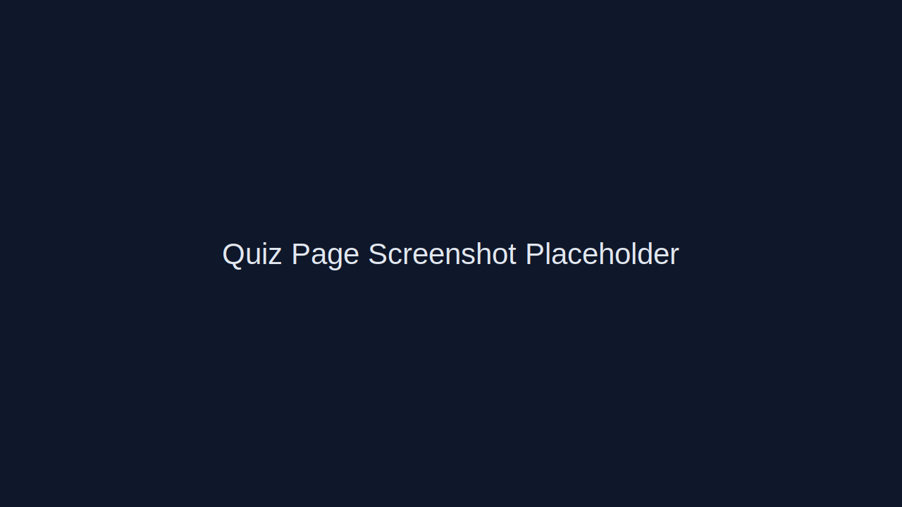
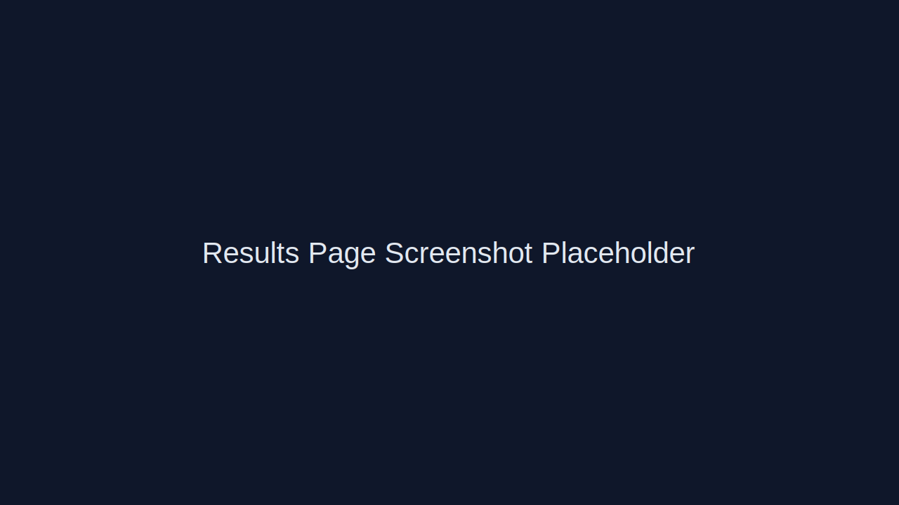
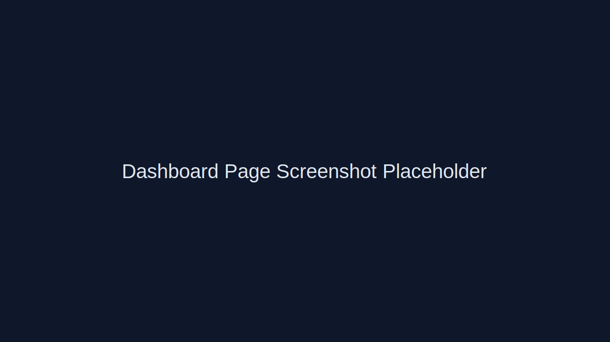

# StudyTech Advisor

> A bilingual smart web platform that helps university students in Malaysia confidently choose the right laptop/device for their academic journey.

## Overview

Choosing a laptop as a student is often confusing, expensive, and risky. Many students are unsure which specifications actually matter for their major, daily workload, and long-term needs.

**StudyTech Advisor** solves this by combining:
- Clear educational guidance on device fundamentals.
- A smart multi-step quiz tailored to each student.
- Trusted, budget-aware recommendations from practical options.

The result is a modern decision-support experience that turns technical uncertainty into confident buying decisions.

## Features

- **Bilingual support (Arabic / English)** with proper **RTL/LTR** layout behavior.
- **Light and Dark mode** with persistent user preference.
- **Learn Device Basics** educational module covering key laptop components and buying logic.
- **Smart Quiz** with multi-step recommendation flow.
- **Personalized recommendations** based on major, budget, usage, and preferences.
- **Trusted Devices page** for affordable student-friendly options.
- **Authentication system** (mock Sign In / Sign Up flow using local persistence).
- **Modern responsive UI** optimized for mobile and desktop.

## Tech Stack

- **Next.js**
- **React**
- **TypeScript**
- **Tailwind CSS**
- **Framer Motion**
- **LocalStorage** (for mock auth/session, language/theme settings, and saved preferences)

## Screenshots

> Replace these placeholders with real screenshots from your running app.

### Home Page


### Quiz Page


### Results Page


### Dashboard


## Installation

### 1) Clone the repository

```bash
git clone <repo-url>
cd StudyTech-Advisor
```

### 2) Install dependencies

```bash
npm install
```

### 3) Run the development server

```bash
npm run dev
```

### 4) Open in browser

Visit:

```text
http://localhost:3000
```

## Project Goals

- Help students buy the right device the first time.
- Improve technical literacy around laptop specifications.
- Provide trustworthy and budget-conscious recommendation pathways.

## License

This project is intended for educational and demo use. Add your preferred open-source license if publishing publicly.
